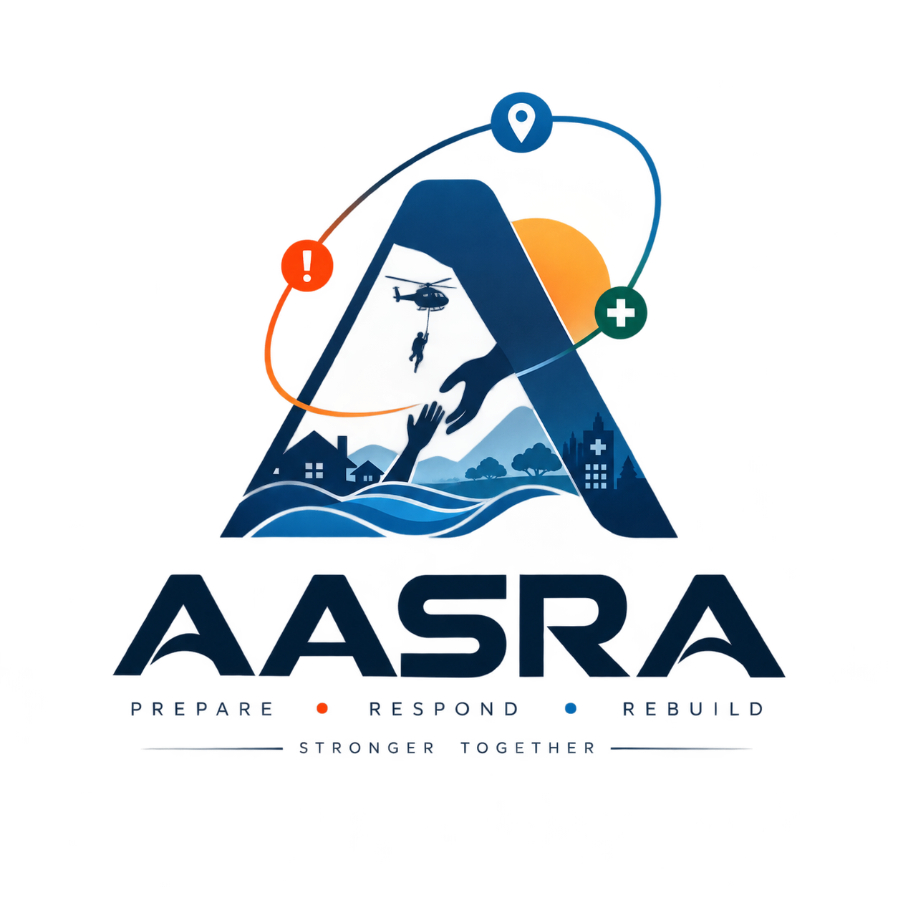
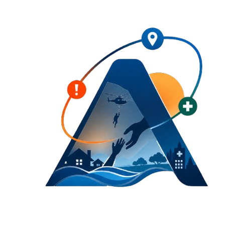
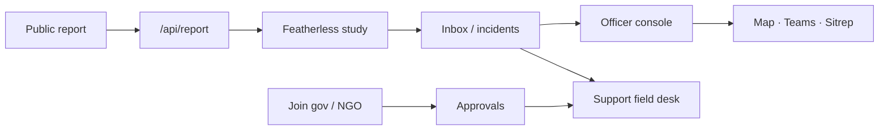

<div align="center">



# Aasra

**Relief mesh for a flood sector.**  
A public report, a verified crew, and an officer share one board — not three chat groups.

[Live site](https://aasra.vercel.app) · [Report help](https://aasra.vercel.app/report) · [Join the desk](https://aasra.vercel.app/join) · [How it works](https://aasra.vercel.app/how-it-works)

<br/>



<br/>

`PREPARE` · `RESPOND` · `REBUILD`

[](https://nextjs.org/)
[](https://www.typescriptlang.org/)
[](https://console.firebase.google.com/project/assra-eff34)
[](https://aasra.vercel.app)

</div>

---

## What this is

Aasra is a **sector control room** for a Krishna-delta flood drill. A household names a landmark and a need. The duty clerk (Featherless) studies the chit, ranks life-safety first, and points the nearest approved government or NGO desk. Officers watch one paper-and-ink console. Field crews claim tickets from `/support`.

It is **not** a donation marketplace, a news site, or a substitute for 112 / 108.

| Paper | Ink | Type |
| :---: | :---: | :---: |
| `#efe6d6` | `#1c1612` | Poppins + the Aasra mark |

---

## Three doors

| Door | Who | Where |
| --- | --- | --- |
| **Public site** | Anyone | `/` · `/report` · `/how-it-works` · `/about` · `/contact` |
| **Support desk** | Approved government / NGO | `/join/government` · `/join/ngo` → `/support` |
| **Officer console** | Allow-listed admins | `/console` (Google sign-in) |

Government and NGO **join on separate forms**. After approval they share **one field portal** (`/support`) — the label only changes (Government desk vs NGO desk). Officers stay on `/console`.

Seed admin: `shrujan29.29@gmail.com`. Support must exist in `approvedSupport`. Desk mail goes out from `aasra.support@gmail.com`.

---

## Pipeline

```
01 Intake     →  landmark + need → structured ticket (optional name)
02 Study      →  Featherless clerk ranks, tags, and logs the chit
03 Verify     →  conflicting reports on the same patch are flagged
04 Prioritise →  life-safety beats blankets
05 Route      →  nearest approved crew by registered area
06 Claim      →  Help on the field desk; officer can hold a bad claim
07 Sitrep     →  what is open, what moved, what knock-on remains
```

Officers do not chat with a model. Every step leaves a log line from Messages → Needs → Teams.

---

## Public mesh

- **Home duty board** — what Aasra is, how to report, how to join, who holds the keys
- **Report help** — place autocomplete (Geoapify / OSM), map pin, free-text need; no login
- **Study on intake** — `POST /api/report` + `POST /api/study` (Featherless; heuristic fallback if the clerk is dark)
- **How it works / About / Contact** — pipeline copy, what this is not, `aasra.support@gmail.com`

---

## Support mesh

- Join as **government official** or **NGO / volunteer** with area of cover and papers
- Admin + clerk read the file on **Approvals**
- Decision mail (pass / hold) from the Aasra desk
- Field portal: open needs, **Help** claim, “X are helping”
- Nearest-org routing from the registered coverage area

---

## Officer console

Grouped the way the rail is grouped.

### Watch

| Desk | Route | What it does |
| --- | --- | --- |
| Needs | `/console` | Ranked open tickets |
| Rank | `/console/priority` | Life-safety first (`/api/prioritize`) |
| Sitrep | `/console/sitrep` | Duty brief (`/api/sitrep`) |
| Predict | `/console/predict` | Before landfall (`/api/predict`) |
| Risk | `/console/risk` | 24–48h flood (`/api/predict-risk`) |
| Wire | `/console/feed` | Chaotic needs & offers (`/api/intake`) |
| Language | `/console/lang` | Detect + English (`/api/translate`) |
| Conflict | `/console/verify` | Blocked vs open (`/api/verify`) |

### Stage

| Desk | Route | What it does |
| --- | --- | --- |
| Stage | `/console/preposition` | Boats / med / water (`/api/preposition`) |
| Vulnerable | `/console/vulnerable` | Who drowns first if the water comes |
| Knock-on | `/console/cascade` | Grid / infrastructure cascade |
| Repair | `/console/repair` | Roads & bridges ranked (`/api/repair-priority`) |

### Ground

| Desk | Route | What it does |
| --- | --- | --- |
| Map | `/console/map` | Leaflet pins for every open incident (severity colour; ward fallback coords) |
| Teams | `/console/allocate` | Who is out (`/api/assign`) |
| Reroute | `/console/reroute` | Closed corridors (e.g. NH-16) (`/api/reroute`) |

### People

| Desk | Route | What it does |
| --- | --- | --- |
| Approvals | `/console/approvals` | Gov & NGO dossiers (`/api/decide`) |
| Keys | `/console/admins` | Who may sign in as officer |

---

## ReliefMesh coverage

Built against the ops brief, not as a slide:

| # | Capability | In Aasra |
| --- | --- | --- |
| 1 | Risk 24–48h | Risk desk |
| 2 | Vulnerability | Vulnerable desk |
| 3 | Pre-position | Stage desk |
| 5 | Chaotic intake | Wire + `/api/intake` |
| 6 | Conflict verify | Conflict desk |
| 7 | Prioritise | Rank desk |
| 9 | Team assign | Teams desk |
| 10 | Dynamic reroute | Reroute desk |
| 16 | Repair rank | Repair desk |
| 19 | Sitrep | Sitrep desk |
| 20 | Multilingual | Language desk |

Plus public study, Help claims, join clerk, and the live emergencies map.

---

## Stack

```
Next.js 16  ·  React 19  ·  TypeScript  ·  Tailwind v4
Firebase Auth (Google)  ·  Cloud Firestore
Featherless  (Qwen/Qwen2.5-7B-Instruct)  — server-only
Geoapify + OSM  — place search
Leaflet  — public report map + ops emergencies map
Nodemailer  — desk chits from Gmail
Vercel  — https://aasra.vercel.app
```

Dual-write: memory + `localStorage` + Firestore, so a jury can still see the board if the cloud API is slow.



---

## Run locally

```bash
npm install
cp .env.example .env.local   # fill keys — never commit this file
npm run dev
```

Open [http://localhost:3000](http://localhost:3000).

---

## Firebase (required for live Auth / writes)

Project: **`assra-eff34`**.

1. [Firebase Console](https://console.firebase.google.com/project/assra-eff34) → **Authentication** → enable **Google**.
2. **Authorized domains:** `localhost`, `aasra.vercel.app`, `assra-eff34.firebaseapp.com`.
3. Create **Firestore**. Paste and **Publish** `firestore.rules` (or `npx firebase-tools deploy --only firestore:rules`).
4. Enable the Cloud Firestore API if REST writes return 403.
5. On Vercel, set every `NEXT_PUBLIC_FIREBASE_*` plus server secrets from `.env.example`.

Do **not** `firebase deploy` this Next app to Hosting. The app stays on Vercel. Auth + Firestore stay on Firebase.

If Google popup says `unauthorized-domain` or `operation-not-allowed`, steps 1–2 are incomplete.

---

## Environment

Copy `.env.example`. Names only — keep values off git:

| Variable | Role |
| --- | --- |
| `NEXT_PUBLIC_FIREBASE_*` | Client Auth / Firestore |
| `NEXT_PUBLIC_SITE_URL` | Canonical site (`https://aasra.vercel.app`) |
| `NEXT_PUBLIC_GEOAPIFY_KEY` | Place autocomplete |
| `FEATHERLESS_API_KEY` / `FEATHERLESS_MODEL` | Duty clerk (server) |
| `GMAIL_USER` / `GMAIL_APP_PASSWORD` | Desk mail |
| `NOTIFY_EMAIL` | Officer inbox for new join chits |

---

## Repo

**GitHub:** [shrujan-sb/AASTRA](https://github.com/shrujan-sb/AASTRA)  
**Production:** [aasra.vercel.app](https://aasra.vercel.app)

<div align="center">

<br/>


<br/>

*Stronger together.*

</div>
